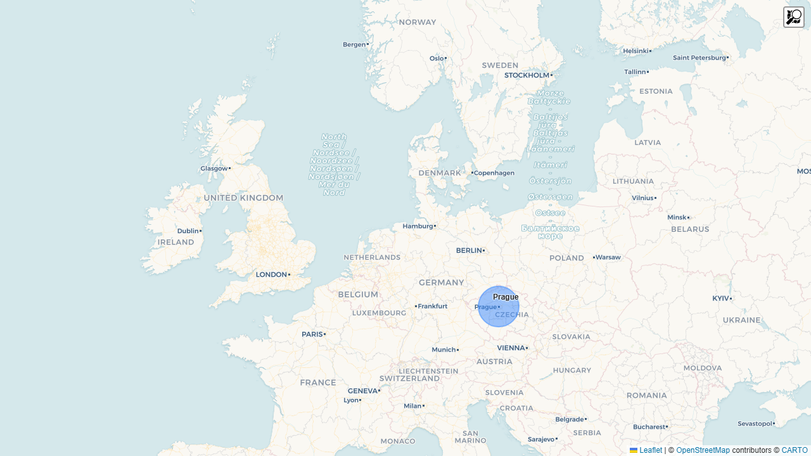
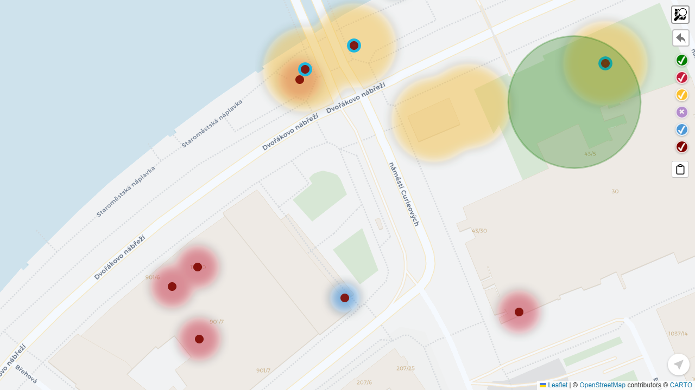
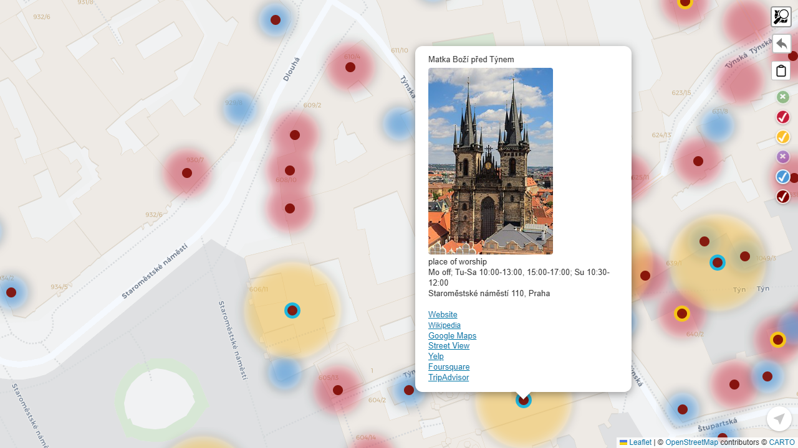

# geo-browser

A lightweight, static, browser-based geographic renderer and trip companion.

`geo-browser` loads catalog-driven geographic data and renders it on an interactive map. It runs entirely from static hosting — no backend required.

---

## Screenshots


*Summary view — world overview with area bubbles*


*Heatmap view — data density across the area*


*Detail view — area map with layers*


*POI popup — enriched place details*


*Place search — Nominatim results bounded to the area*

---

## Features

### Map & Navigation
- **Summary view** — world overview with one bubble per area; tap to enter
- **Detail view** — immersive area map with layers, POIs, and controls
- **Tile providers** — CARTO Voyager (default) or OpenStreetMap, switchable from the layer flyout
- **Geolocation** — live GPS blue dot with heading cone
- **Last view persistence** — reopens the last visited area on startup

### Layers & Data
- **Heatmaps** — density overlays from weighted GeoJSON points
- **Circle markers** — point data rendered as scaled circles
- **POI layer** — tappable markers for enriched places; popup shows name, cuisine, address, opening hours, star rating, outdoor seating, Wikipedia/Wikidata links, and a Wikidata thumbnail
- **Layer flyout** — per-layer visibility toggles and tile provider switch, accessible from the map toolbar

### Trip Recording
- **User points** — long-press (or right-click on desktop) anywhere on the map to drop a trip point
- **Star ratings** — rate any point 1–5 stars; ring color reflects the rating
- **Bookmarks** — bookmark points for later; blue ring overlay distinguishes them
- **Trip export** — share or download your trip points as GeoJSON from the layer flyout

### Place Search
- **Nominatim search** — type a place name and find it within the current area
- **Bounded results** — results are constrained to the area bbox; no noise from outside
- **Browse hits** — results list stays open so you can check each result in turn
- **Promote to trip point** — tap the search marker to save it as a permanent trip point
- **Offline aware** — search bar disables gracefully when offline; everything else keeps working

### Image Overlay
- **Paste a map image** — paste a screenshot from Google Maps, Apple Maps, or any source
- **3-DOF editor** — translate (drag), scale (pinch/scroll), and adjust opacity
- **Geo-lock** — pin the image to a GPS coordinate; it stays anchored as you pan and zoom
- **Blue dot detection** — automatic detection of the GPS dot in pasted images for instant alignment

### Offline First
All features except place search work without a network connection. Data is fetched on demand and the app functions as a PWA.

---

## Philosophy

- **Static first** — runs entirely from static hosting (e.g., Cloudflare Pages)
- **Protocol-driven** — all data comes from JSON contracts
- **No frameworks** — TypeScript + Vite + Leaflet only

---

## How It Works

The app has two modes:

- **Summary** — world overview; one bubble per area
- **Detail** — immersive area view with layers, POIs, and controls

Data loads in stages:

```
Catalog → Area manifest → Layers (GeoJSON) → Map
```

Startup fetches `/catalog.head.json` (cache-busted) to find the catalog URL, then each area fetches its own manifest, and each layer fetches its own GeoJSON on demand.

---

## Layer Types

| Type | Description |
|------|-------------|
| `heatmap` | Density heatmap from weighted GeoJSON points |
| `circle` | Circle markers from GeoJSON points |
| `__poi__` | Virtual — tappable POI markers from features with `hasDetails: true` |
| `__user__` | Virtual — user-recorded trip points (long-press / right-click) |
| `__void__` | Virtual — mundane zone overlay, highlights low-density areas |
| `__search__` | Virtual — ephemeral Nominatim search result marker |

POI popups show baked metadata: name, cuisine, address, opening hours, star rating, outdoor seating, Wikipedia/Wikidata links, and a Wikidata thumbnail image.

---

## Getting Started

```bash
npm install
npm run dev      # dev server at http://localhost:5173
npm run build    # production build → dist/
npm test         # unit tests (Vitest)
```

Deploy `dist/` to any static host.

---

## License

MIT
