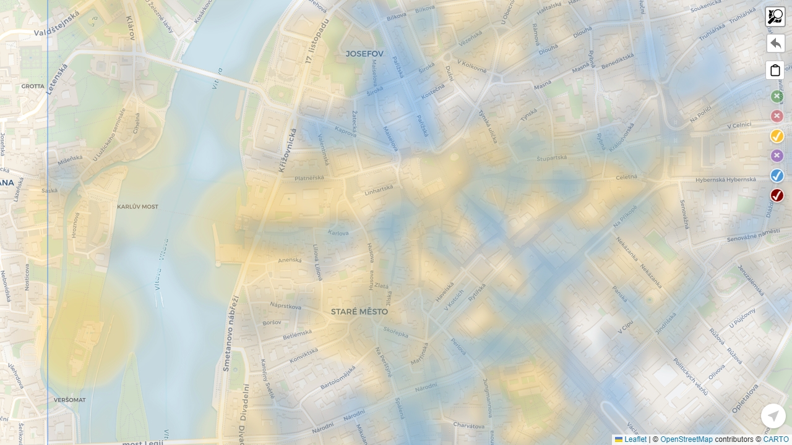
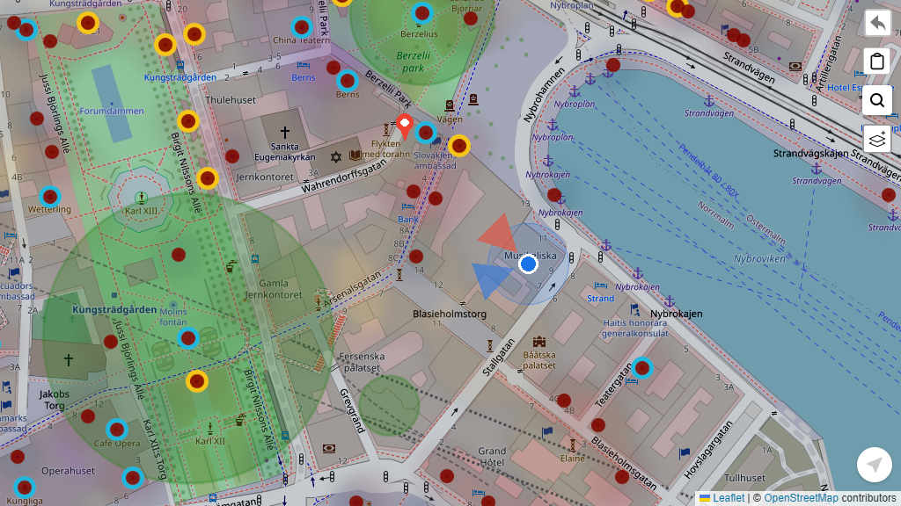
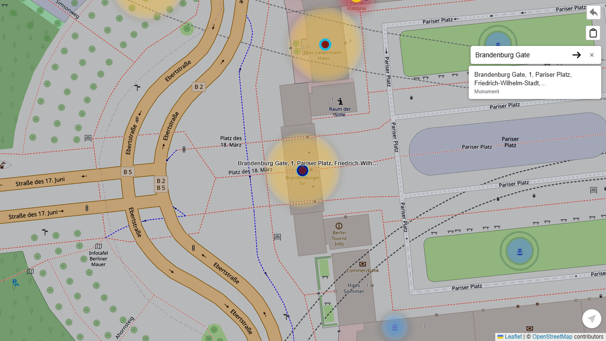

# geo-browser

A lightweight, static, browser-based geographic renderer and trip companion.

`geo-browser` loads catalog-driven geographic data and renders it on an interactive map. It runs entirely from static hosting — no backend required.

---

## Screenshots


*World overview — every area rendered as a circle or bbox outline until it's zoomed into*


*Heatmap view — data density across the area*


*A loaded area — layers, POIs, and controls once it becomes the current area*


*POI popup — enriched place details*


*Destination marker — red pin and bearing cone pointing toward your destination*


*Place search — Nominatim results bounded to the area*

---

## Features

### Map & Navigation
- **One continuous map** — no separate "world" and "area" screens; zoom and pan freely and areas smoothly grow from a circle to a bbox outline to fully loaded layers as you get closer
- **Tap to jump** — tap any area's circle or outline to pan/zoom straight to it
- **Multiple areas at once** — any number of nearby areas can be loaded simultaneously; only the one you're centered on gets its POI/trip/search layers and toolbox
- **Tile providers** — CARTO Voyager (default) or OpenStreetMap, switchable from the layer flyout
- **Geolocation** — live GPS blue dot with heading cone; heading comes from the device compass (`DeviceOrientationEvent`), requested on first use — iOS shows a one-time permission prompt
- **Viewport persistence** — the map reopens at the same position and zoom on startup, and each area remembers its own layer visibility

### Layers & Data
- **Heatmaps** — density overlays from weighted GeoJSON points
- **Circle markers** — point data rendered as scaled circles
- **POI layer** — tappable markers for enriched places; popup shows name, cuisine, address, opening hours, star rating, outdoor seating, Wikipedia/Wikidata links, and a Wikidata thumbnail
- **Layer flyout** — per-layer visibility toggles and tile provider switch, accessible from the map toolbar

### POI Actions
Tapping a POI marker or an empty patch of map opens a callout. Its action row is separate from the metadata shown above:
- **Star rating** — tap 1–5 stars; for a POI, this saves a new trip point at that location with the rating attached (or re-rates an existing one). For empty-space taps, it creates a starred trip point there.
- **Bookmark toggle** — available when creating a new point (POI callout or empty-space callout); saves a bookmarked trip point. Tapping the toggle again on an already-bookmarked POI removes the point.
- **Delete** — shown instead of the bookmark toggle when the callout is for an *existing* trip point; removes it.
- **Set/Remove destination** — independent of star/bookmark/delete; see [Destination](#destination) below.

### Trip Recording
- **User points (`__user__` layer)** — tap empty map space to open a callout, then tap a star or the bookmark toggle to save a point there; tapping an existing point's marker reopens the callout with a delete button instead
- **Star ratings** — rate any point 1–5 stars; ring color reflects the rating
- **Bookmarks** — blue ring overlay distinguishes bookmarked points; ring is set at creation time and takes visual priority over the star ring
- **Storage** — points are stored per-area as a GeoJSON `FeatureCollection`, either in `localStorage` (browse mode) or via the `geo-builder` gateway (design mode)
- **Trip export** — share or download your trip points as GeoJSON from the layer flyout

### Destination
A single "which way is it, roughly" indicator — not routing, just a fixed pin plus a bearing cone on your live position.
- **Set/remove** — the POI/empty-space callout's action row has a destination toggle (independent of star/bookmark/delete — a point can be starred *and* be the destination). Tapping the destination pin itself also opens a callout with a "Remove destination" action, since re-tapping the exact original coordinates of a non-POI destination isn't practical.
- **Singular** — only one destination at a time; setting a new one silently replaces the old one.
- **Pin** — a fixed red marker at the destination's location, shown whenever it's in the viewport, independent of GPS.
- **Bearing cone** — anchored at your live GPS position (same point as the blue heading cone), pointing along the great-circle bearing to the destination — pure geometry, not compass heading, so it needs no extra permissions. Only shown while a position is available; the pin stays either way.
- **Storage** — global (not per-area) in `localStorage`, entirely client-side; no `geo-builder` involvement.

### Place Search
- **Nominatim search** — type a place name and find it within the current area
- **Bounded results** — results are constrained to the area bbox; no noise from outside
- **Browse hits** — results list stays open so you can check each result in turn
- **Promote to trip point** — tap the search marker to save it as a permanent trip point
- **Offline aware** — search bar disables gracefully when offline; everything else keeps working

### Image Overlay
- **Paste a map image** — paste a screenshot from Google Maps, Apple Maps, or any source
- **3-DOF editor** — translate (drag), scale (pinch/scroll), and adjust opacity
- **Geo-lock** — pin the image to a GPS coordinate; it stays anchored as you pan and zoom
- **Blue dot detection** — automatic detection of the GPS dot in pasted images for instant alignment

### Offline First
All features except place search work without a network connection. Data is fetched on demand and the app functions as a PWA.

---

## Philosophy

- **Static first** — runs entirely from static hosting (e.g., Cloudflare Pages)
- **Protocol-driven** — all data comes from JSON contracts
- **No frameworks** — TypeScript + Vite + Leaflet only

---

## How It Works

There's a single shared map, not separate modes. Each area independently tracks its own on-screen size and the current zoom to decide how it renders:

- **Circle** — too small on screen to be worth more detail
- **Outline** — big enough to show its extent, not yet loaded (or the zoom is too far out for any area to load)
- **Loaded** — layers rendered; any number of areas can be loaded at once, but only the one nearest the viewport center becomes "current" and gets its POI/trip/search layers and toolbox

Data loads in stages:

```
Catalog → Area manifest → Layers (GeoJSON) → Map
```

Startup fetches `/catalog.head.json` (cache-busted) to find the catalog URL, then each area fetches its own manifest, and each layer fetches its own GeoJSON on demand.

---

## Layer Types

| Type | Description |
|------|-------------|
| `heatmap` | Density heatmap from weighted GeoJSON points |
| `circle` | Circle markers from GeoJSON points |
| `__poi__` | Virtual — tappable POI markers from features with `hasDetails: true` |
| `__user__` | Virtual — user-recorded trip points, created via callout tap (see [Trip Recording](#trip-recording)) |
| `__void__` | Virtual — mundane zone overlay, highlights low-density areas |
| `__search__` | Virtual — ephemeral Nominatim search result marker |

POI popups show baked metadata: name, cuisine, address, opening hours, star rating, outdoor seating, Wikipedia/Wikidata links, and a Wikidata thumbnail image. POI *action* buttons (star, bookmark) are separate — see [POI Actions](#poi-actions).

The live GPS position (blue dot + heading cone) is **not** a layer — it's a standing map control (`GeoLocationWidget`) that's always available, independent of the catalog/manifest or which area (if any) is currently loaded.

---

## Getting Started

```bash
npm install
npm run dev      # dev server at http://localhost:5173
npm run build    # production build → dist/
npm test         # unit tests (Vitest)
```

Deploy `dist/` to any static host.

---

## License

MIT
