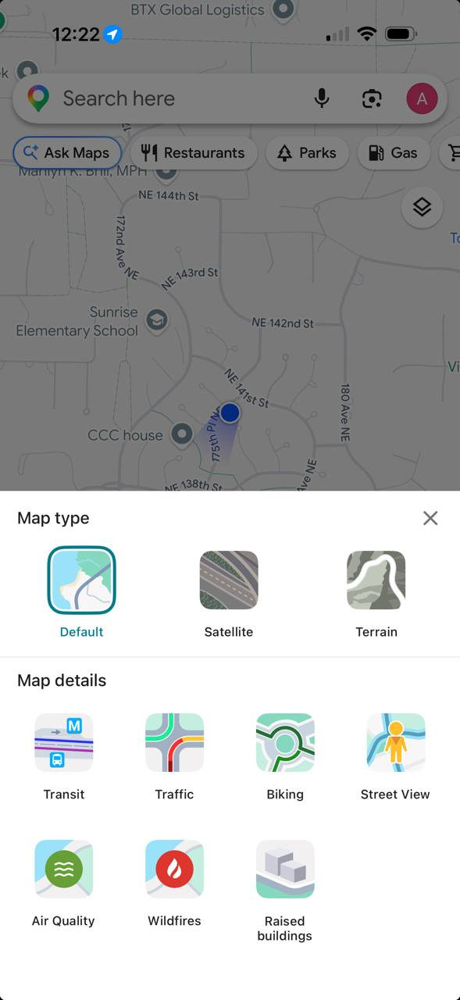

# Layer Selection Flyout

## Status: Done

## Problem Statement

Declutter the map by replacing the current `LayerControl` and `TileProviderControl` widgets with a single layers icon that opens a flyout panel, similar to Google Maps.

## Design

- A single layers icon button in the topright opens the flyout.
- Tapping outside the flyout dismisses it; any changes made are applied immediately.
- The topright toolbar otherwise shows only the back-to-summary control. GPS stays at bottomright.
- The flyout has two sections:
  - **Map type** (top row): OSM and CARTO as toggle options — replaces `TileProviderControl`.
  - **Map details** (layer list): one entry per layer, icon + name. Clicking toggles visibility.
- The layer icon is a filled circle in the layer's `color` from the manifest style.
- The manifest `visible` field is respected as the initial value when no persisted state exists. Layer visibility is persisted across sessions via existing storage.

## Summary view

The flyout is also present in summary view. It shows only the **Map type** section — no layer list (there are no layers in summary mode).

## Out of scope

- No changes to `DetailViewState` persistence model — layer visibility already stored there.
